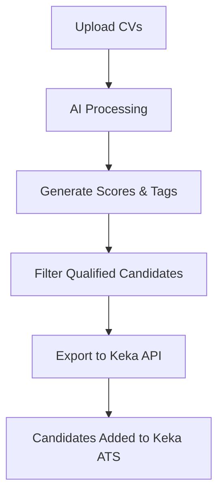

# AI Resume Screener - Keka Integration Guide

## Overview

The AI Resume Screener is designed to integrate seamlessly with Keka ATS (Applicant Tracking System) to automate the resume screening process. This system can process thousands of CVs in seconds and automatically add relevant tags and scores to each candidate profile.

## How CV Screening Works

### 1. **Bulk CV Upload**
- **Method**: Direct file upload through the web interface
- **Supported Formats**: PDF, DOC, DOCX
- **Capacity**: Can handle 1000+ files simultaneously
- **Process**: Drag-and-drop or file browser selection

### 2. **AI Processing Pipeline**
```
CV Upload → Text Extraction → AI Analysis → Skill Extraction → Scoring → Tagging → Keka Export
```

#### Step-by-Step Process:
1. **Text Extraction**: Extract text content from uploaded resume files
2. **AI Analysis**: Use GPT-4 to analyze candidate information
3. **Skill Identification**: Automatically identify technical and soft skills
4. **Experience Calculation**: Determine years of experience and seniority level
5. **Education Parsing**: Extract education details and qualifications
6. **Job Matching**: Compare against specific job requirements (if selected)
7. **Scoring**: Generate relevance scores (0-100) based on job fit
8. **Tagging**: Add relevant tags (e.g., "Senior Developer", "Remote Ready", "Full Stack")

### 3. **Keka Integration Methods**

#### Option A: **Direct API Integration** (Recommended)
- **Setup**: Configure Keka API credentials in Settings
- **Process**: Automatic export of qualified candidates
- **Benefits**: Real-time sync, automated workflow
- **Requirements**: Keka API access and organization ID

#### Option B: **Browser Extension** (Future Enhancement)
- **Concept**: Chrome/Firefox extension for Keka users
- **Functionality**: 
  - Detect when user is on Keka candidate pages
  - Automatically screen uploaded CVs
  - Add AI-generated tags and scores directly to Keka profiles
  - Bulk import capabilities

#### Option C: **CSV/Excel Export**
- **Process**: Export screened candidates as structured data
- **Import**: Manual import into Keka using their bulk import feature
- **Use Case**: For organizations without API access

## Integration Workflow

### Current Implementation (API-Based)



### 1. **Setup Phase**
- Configure Keka API credentials in Settings tab
- Set up job requirements and intake documents
- Define scoring thresholds and auto-export criteria

### 2. **Processing Phase**
- Upload resume files (bulk supported)
- Select target job position (optional but recommended)
- AI processes each resume in parallel
- Real-time progress tracking

### 3. **Review Phase**
- Review AI-generated scores and tags
- Filter candidates by score, skills, experience
- Manual review of borderline candidates
- Bulk selection for export

### 4. **Export Phase**
- Automatic export of qualified candidates (score ≥ threshold)
- Manual export of selected candidates
- Direct integration with Keka candidate database
- Preserve all AI-generated metadata

## Browser Extension Concept (Future)

### How It Would Work:
1. **Installation**: Install browser extension from Chrome/Firefox store
2. **Authentication**: Connect to your AI Resume Screener account
3. **Auto-Detection**: Extension detects when you're on Keka pages
4. **One-Click Screening**: 
   - Upload CV directly from Keka interface
   - AI processes in background
   - Results appear as overlay or sidebar
5. **Auto-Tagging**: Automatically add tags to Keka candidate profiles
6. **Bulk Processing**: Process multiple candidates from Keka candidate list

### Extension Features:
- **Smart Detection**: Recognizes Keka ATS interface
- **Seamless Integration**: Works within existing Keka workflow
- **Real-time Processing**: Instant AI analysis
- **Auto-Sync**: Sync scores and tags back to main dashboard
- **Offline Capability**: Queue processing when offline

## Data Flow Architecture

### Input Sources:
1. **Direct Upload**: Web interface bulk upload
2. **Keka API**: Pull candidates from Keka
3. **Email Integration**: Process CVs from email attachments
4. **Browser Extension**: Process from Keka interface

### Processing Engine:
- **AI Models**: GPT-4 for analysis, custom models for skill extraction
- **Parallel Processing**: Handle multiple CVs simultaneously
- **Queue Management**: Manage large batch processing
- **Error Handling**: Retry failed processing, manual review queue

### Output Destinations:
1. **Keka ATS**: Direct API integration
2. **Dashboard**: Internal candidate database
3. **Export Files**: CSV, Excel, JSON formats
4. **Email Reports**: Automated summaries and alerts

## Security & Compliance

### Data Protection:
- **Encryption**: All CV data encrypted at rest and in transit
- **Access Control**: Role-based permissions
- **Audit Logging**: Complete processing history
- **Data Retention**: Configurable retention policies
- **GDPR Compliance**: Right to deletion, data portability

### API Security:
- **OAuth 2.0**: Secure Keka API authentication
- **Rate Limiting**: Prevent API abuse
- **IP Whitelisting**: Restrict access by IP
- **Token Rotation**: Regular API key rotation

## Configuration Options

### AI Settings:
- **Model Selection**: GPT-4, GPT-3.5, Claude 3
- **Scoring Weights**: Experience (30%), Skills (40%), Education (30%)
- **Custom Prompts**: Organization-specific screening criteria
- **Auto-Tagging**: Enable/disable automatic tag generation

### Keka Integration:
- **API Credentials**: URL, API key, Organization ID
- **Auto-Export Threshold**: Minimum score for automatic export
- **Export Format**: JSON, XML, CSV
- **Sync Frequency**: Real-time, hourly, daily
- **Field Mapping**: Map AI fields to Keka candidate fields

### Notification Settings:
- **Processing Complete**: Email when batch processing finishes
- **High-Score Alerts**: Notify for exceptional candidates
- **Error Notifications**: Alert for processing failures
- **Weekly Reports**: Summary of screening activity

## Benefits for HR Teams

### Time Savings:
- **90% Reduction**: In manual resume screening time
- **Instant Processing**: 1000+ CVs processed in minutes
- **Automated Tagging**: No manual categorization needed
- **Smart Filtering**: AI-powered candidate ranking

### Quality Improvements:
- **Consistent Scoring**: Eliminate human bias
- **Comprehensive Analysis**: Extract details humans might miss
- **Job-Specific Matching**: Tailored scoring for each role
- **Skills Gap Analysis**: Identify missing skills in candidate pool

### Workflow Integration:
- **Seamless Keka Integration**: Works within existing ATS
- **Bulk Operations**: Process large candidate volumes
- **Real-time Updates**: Live progress tracking
- **Mobile Access**: Review candidates on mobile devices

## Getting Started

### Step 1: Setup
1. Sign up for AI Resume Screener account
2. Configure Keka API integration in Settings
3. Create job requirements and upload intake documents
4. Set scoring thresholds and notification preferences

### Step 2: First Screening
1. Navigate to Upload tab
2. Select target job position
3. Upload resume files (drag-and-drop supported)
4. Monitor processing progress
5. Review results in Results tab

### Step 3: Export to Keka
1. Filter qualified candidates
2. Review AI-generated scores and tags
3. Select candidates for export
4. Click "Export to Keka" button
5. Verify candidates appear in Keka ATS

### Step 4: Optimization
1. Review screening accuracy
2. Adjust AI scoring weights if needed
3. Update job requirements based on results
4. Set up automated workflows for recurring positions

## Support & Troubleshooting

### Common Issues:
- **API Connection Errors**: Check Keka credentials and network connectivity
- **Processing Failures**: Verify file formats and sizes
- **Low Accuracy**: Review job requirements and AI prompts
- **Export Issues**: Confirm Keka API permissions

### Best Practices:
- **Job-Specific Screening**: Always select target job for better accuracy
- **Intake Documents**: Upload detailed job requirements for enhanced matching
- **Regular Calibration**: Review and adjust scoring criteria periodically
- **Batch Processing**: Process similar roles together for consistency

### Contact Support:
- **Email**: support@airesumescreener.com
- **Documentation**: Full API documentation available
- **Training**: Live training sessions for HR teams
- **Custom Integration**: Enterprise solutions available

---

This integration transforms the traditional resume screening process from a manual, time-intensive task into an automated, AI-powered workflow that seamlessly integrates with your existing Keka ATS infrastructure.